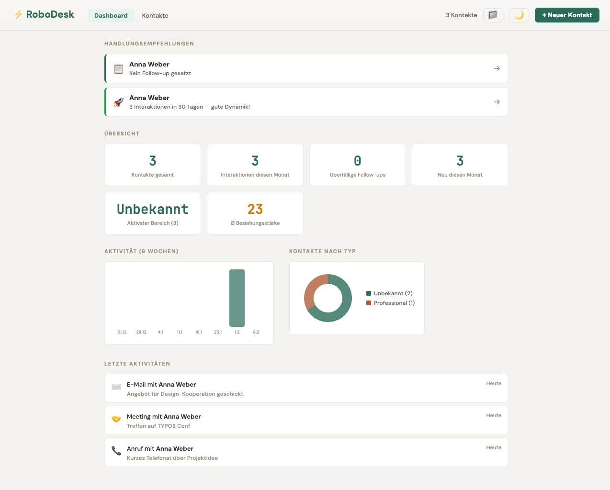
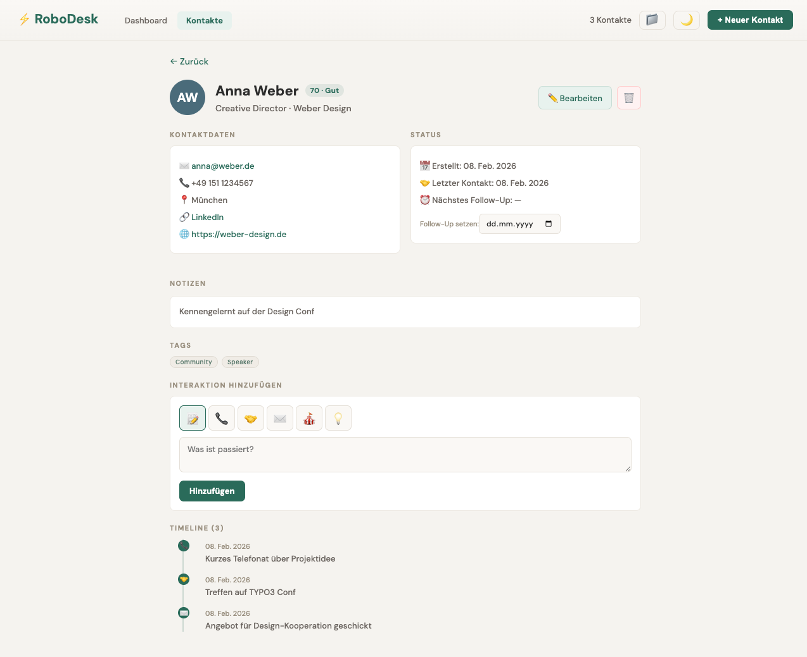
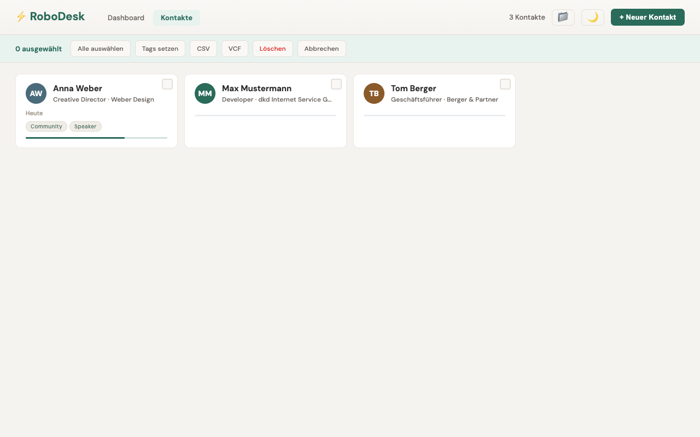
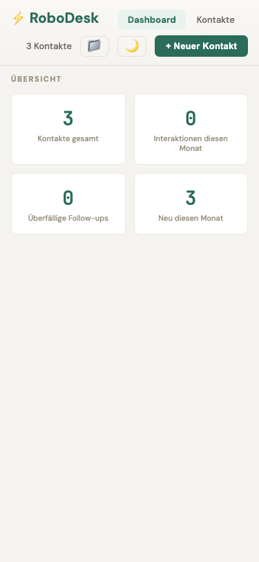

# RoboDesk

A personal CRM focused on relationship cultivation, not sales pipelines. Built as a single-file React application with no backend — all data stays in your browser.

**[Live Demo](https://dkd-dobberkau.github.io/RoboDesk/)**



## Features

- **Dashboard** with recommendations, activity charts, and relationship overview
- **Timeline** view showing all interactions across contacts with type filtering
- **Contact Management** with detailed profiles, interaction history, and follow-up tracking
- **Relationship Strength** scoring based on interaction frequency and recency
- **Smart Nudges** for overdue follow-ups, neglected contacts, and momentum tracking
- **Bulk Actions** for tagging, exporting, and deleting multiple contacts
- **Import/Export** via CSV and vCard (VCF) formats
- **Dark Mode** with a carefully designed dual-theme system
- **4 Languages** — German, English, Danish, French
- **Keyboard Shortcuts** — `n` new contact, `d` dashboard, `t` timeline, `k` contacts, `/` search
- **Mobile Responsive** layout

<details>
<summary>More screenshots</summary>

| Contact Detail | Bulk Mode | Mobile |
|---|---|---|
|  |  |  |

</details>

## Architecture

The entire application lives in a single file (`robodesk.jsx`, ~2200 lines). No external dependencies beyond React. All styling is inline via a theme-aware style factory.

**Storage:** Uses `localStorage` in the browser (or `window.storage` when running as a Claude Artifact). Data is stored under three keys: `robodesk-contacts`, `robodesk-tags`, `robodesk-theme`.

**Components:** `RoboDesk` (main app + state), `Dashboard`, `GlobalTimeline`, `ContactCard`, `ContactDetail`, `ContactForm`, `makeStyles`.

## Development

```bash
npm install
npm run dev
```

Build for production:

```bash
npm run build
```

## Deployment

Every push to `main` triggers a GitHub Actions workflow that builds with Vite and deploys to GitHub Pages.

## License

[MIT](LICENSE)
